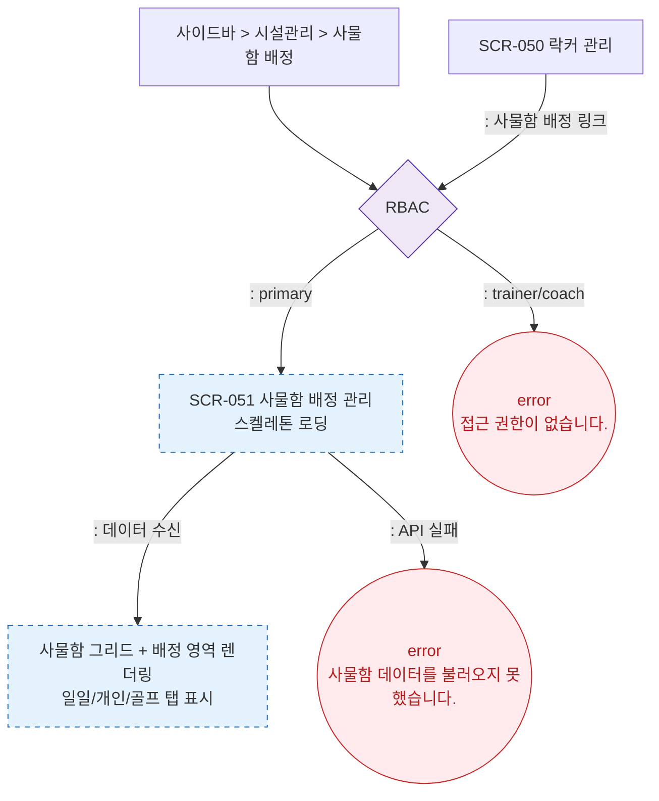

# F1 진입 플로우 — SCR-051 사물함 배정 관리

## 다이어그램

## TC 후보

| TC ID | 타입 | Given | When | Then | |-------|------|-------|------|------| | TC-051-001 | positive | manager | 사물함 배정 메뉴 클릭 | SCR-051 진입, 그리드 표시 | | TC-051-002 | negative | API 실패 | 페이지 진입 | error 토스트 |
