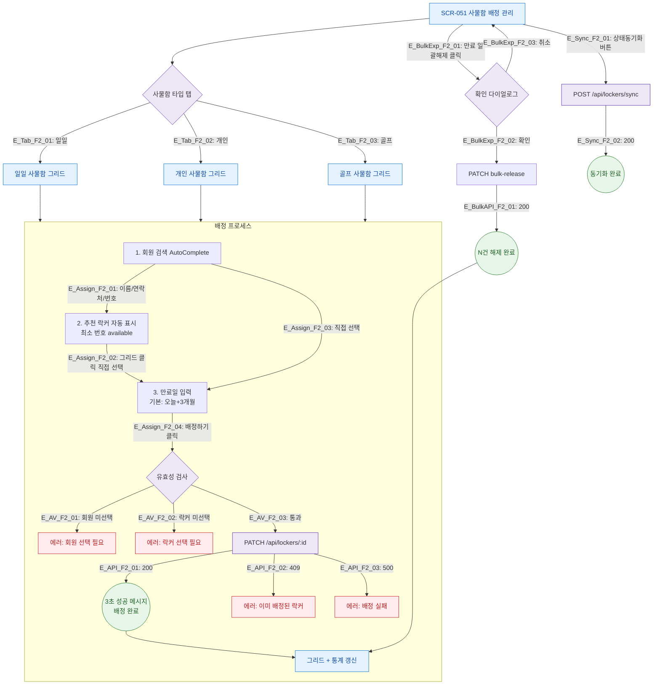

# F2 메인 인터랙션 플로우 — SCR-051 사물함 배정 관리

## 1. 목적
사물함 배정·만료일괄해제·락커추가의 Happy Path와 분기를 정의한다.

## 2. 전제조건
- SCR-051 정상 진입, 사물함 데이터 존재

## 3. 다이어그램

## 4. 엣지 설명

| 엣지 ID | 출발 | 도착 | 조건 |
|---------|------|------|------|
| E_Tab_F2_01~03 | 탭 선택 | 그리드 | 탭 클릭 |
| E_Assign_F2_01~04 | 배정 단계 | 다음 단계 | 순서대로 진행 |
| E_AV_F2_01~02 | 유효성검사 | 에러 | 입력 누락 |
| E_API_F2_01~03 | API | 결과 | 응답코드별 |
| E_BulkExp_F2_01~03 | 일괄해제 | API/취소 | 확인 여부 |

## 5. TC 후보

| TC ID | 타입 | Given | When | Then |
|-------|:----:|-------|------|------|
| TC-051-001 | positive | 탭 전환 | 개인 사물함 탭 클릭 | 개인 사물함 그리드 표시 |
| TC-051-002 | positive | 데이터 존재 | "홍" 입력 | 홍 포함 회원 드롭다운 |
| TC-051-003 | positive | available 존재 | 회원 선택 | 최소 번호 자동 추천 |
| TC-051-004 | positive | 회원+락커+만료일 | 배정하기 클릭 | 3초 성공 메시지 |
| TC-051-005 | negative | 회원 미선택 | 배정하기 클릭 | 배정 버튼 disabled |
| TC-051-006 | positive | overtime 락커 존재 | 일괄해제 → 확인 | available 전환 |
