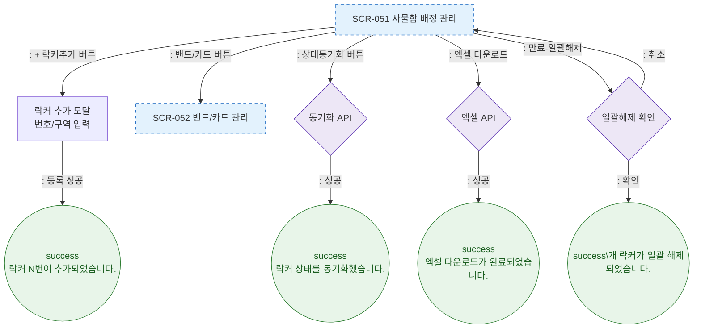

# F3 버튼 액션 플로우 — SCR-051 사물함 배정 관리

## 다이어그램

## TC 후보

| TC ID | 타입 | Given | When | Then | |-------|------|-------|------|------| | TC-051-007 | positive | 락커 추가 클릭 | 번호/구역 입력 → 등록 | success 토스트 "락커 N번 추가" |
