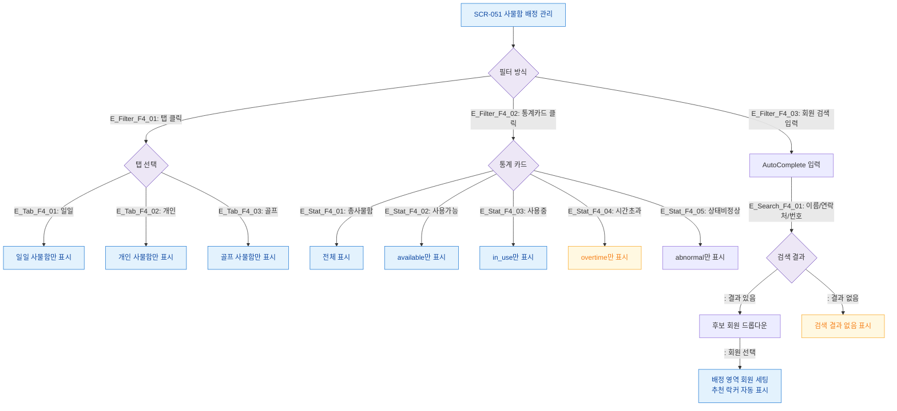

# F4 필터/검색 플로우 — SCR-051 사물함 배정 관리

## 1. 목적
사물함 타입 탭 필터·회원 검색 AutoComplete·통계 카드 필터 동작을 정의한다.

## 2. 전제조건
- SCR-051 정상 진입, 사물함 데이터 존재

## 3. 다이어그램

## 4. 엣지 설명

| 출발 | 도착 | 조건 | |---------|------|------|------| | E_Tab_F4_01~03 | 탭선택 | 그리드 | 탭 클릭 | | E_Stat_F4_01~05 | 통계카드 | 필터결과 | 카드 클릭 | | E_Search_F4_01 | 검색입력 | 검색결과 | 텍스트 입력 | | | 드롭다운 | 회원선택 | 항목 클릭 |
