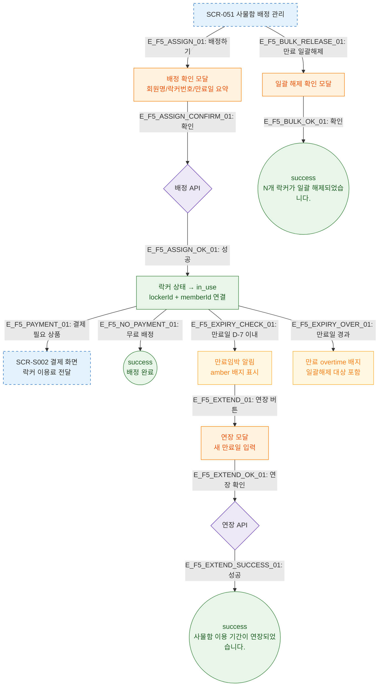

# F5 모달 트리거 트리 + 배정→결제→만료→연장 — SCR-051 사물함 배정 관리

## 목적
사물함 배정의 전체 생명주기: 배정 → 결제 연동 → 만료 감지 → 연장 처리 플로우를 상세화한다.

## 다이어그램

## TC 후보

| TC ID | 타입 | Given | When | Then |
|-------|------|-------|------|------|
| TC-051-004 | positive | 배정 확인 | 확인 클릭 | 배정 완료, 그리드 갱신 |
| TC-051-006 | positive | overtime 락커 일괄해제 | 확인 클릭 | N개 available 전환 |
