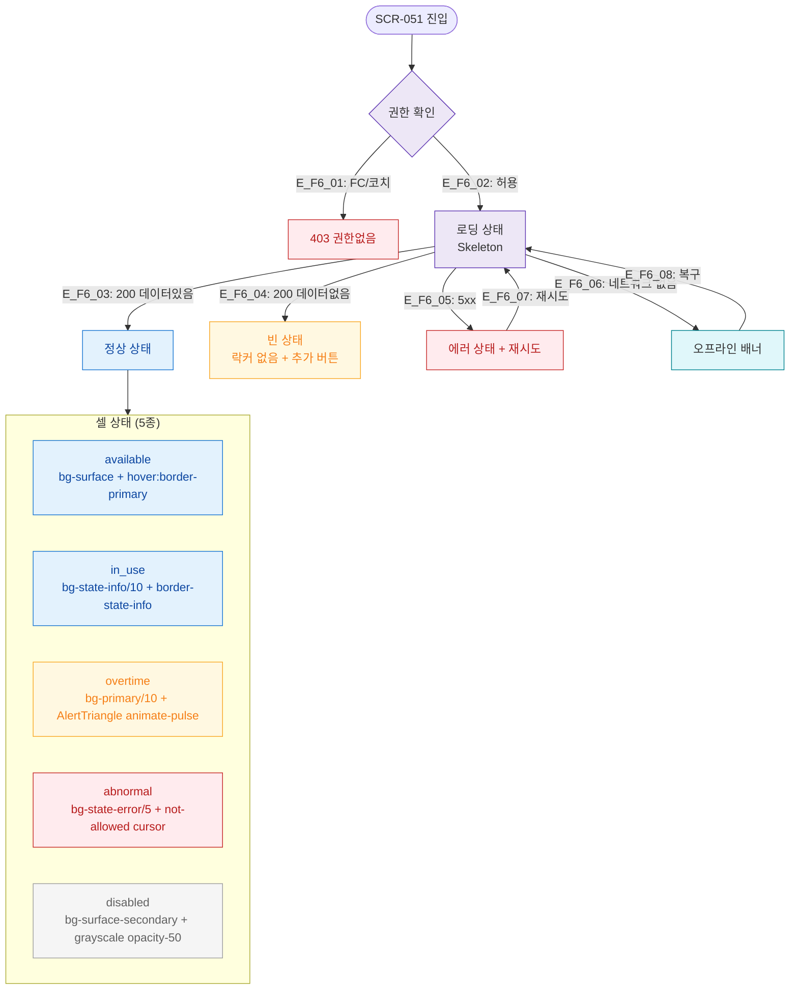

# F6 상태별 화면 플로우 — SCR-051 사물함 배정 관리

## 1. 목적
로딩/빈/에러/오프라인 상태와 셀 5가지 상태를 정의한다.

## 2. 다이어그램

## 4. 엣지 설명

| 엣지 ID | 상태 | 전환 조건 |
|---------|------|-----------|
| E_F6_01 | → 403 | FC/코치 역할 |
| E_F6_03 | → 정상 | 200 + 데이터 |
| E_F6_04 | → 빈상태 | 200 + 0건 |
| E_F6_05 | → 에러 | 5xx |
| E_F6_06 | → 오프라인 | 네트워크 없음 |

## 5. TC 후보

| TC ID | 타입 | Given | When | Then |
|-------|:----:|-------|------|------|
| TC-051-F6-01 | negative | FC 로그인 | /locker/management 접근 | 403 |
| TC-051-F6-02 | exception | API 500 | 페이지 로드 | 에러 상태 + 재시도 |
| TC-051-F6-03 | positive | overtime 셀 | 화면 확인 | AlertTriangle animate-pulse 표시 |
