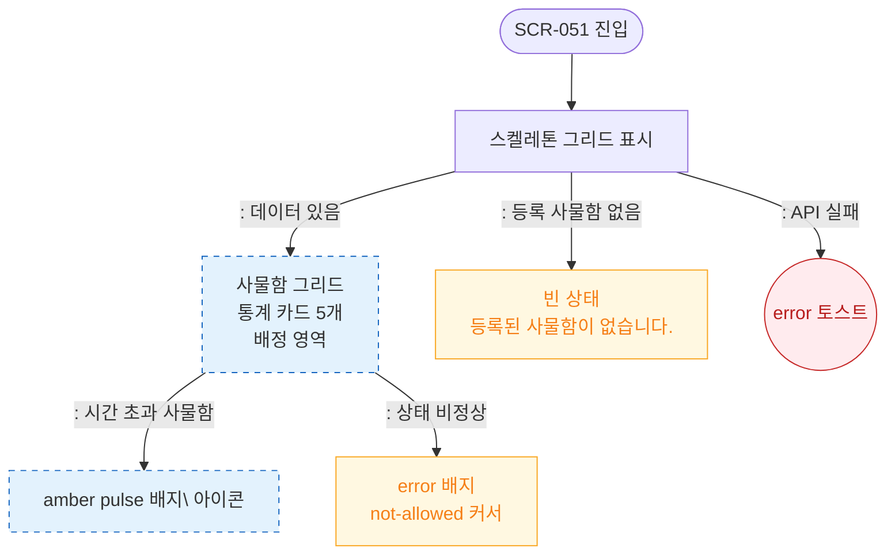

# F6 상태별 화면 플로우 — SCR-051 사물함 배정 관리

## 다이어그램

```mermaid
flowchart TD
    ENTER([SCR-051 진입]) --> Loading[스켈레톤 그리드 표시]
    Loading -->|": 데이터 있음"|StateNormal[사물함 그리드\n통계 카드 5개\n배정 영역]
    Loading -->|": 등록 사물함 없음"|StateEmpty[빈 상태\n등록된 사물함이 없습니다.]
    Loading -->|": API 실패"|StateErr((error 토스트))

    StateNormal -->|": 시간 초과 사물함"|OvertimeBadge[amber pulse 배지\ 아이콘]
    StateNormal -->|": 상태 비정상"|AbnormalBadge[error 배지\nnot-allowed 커서]

    classDef screen fill:#E3F2FD,stroke:#1565C0,stroke-dasharray:5 5
    classDef warning fill:#FFF8E1,stroke:#F9A825,color:#F57F17
    classDef error fill:#FFEBEE,stroke:#C62828,color:#B71C1C
    class StateNormal,OvertimeBadge screen
    class StateEmpty,AbnormalBadge warning
    class StateErr error
```

## TC 후보

| TC ID | 타입 | Given | When | Then | |-------|------|-------|------|------| | TC-051-001 | positive | 탭 전환 | 개인 사물함 탭 클릭 | 개인 사물함 그리드 표시 |
