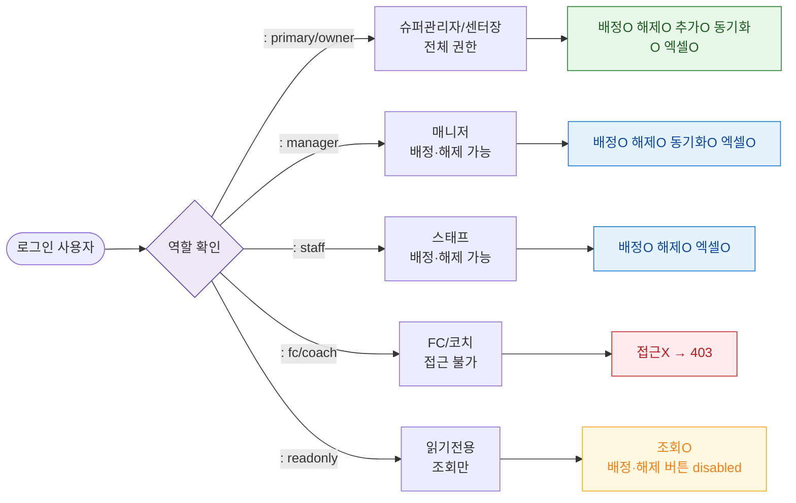

# F7 권한(RBAC) 분기 플로우 — SCR-051 사물함 배정 관리

## 1. 목적
6개 역할별 접근·배정·해제 권한 분기를 정의한다.

## 2. 다이어그램

## 4. 엣지 설명

| 역할 | 권한 범위 | |---------|------|-----------| | | primary/owner | 전체 | | | manager | 배정·해제·동기화·엑셀 | | | staff | 배정·해제·엑셀 | | | fc/coach | 접근 불가 | | | readonly | 조회만 |
