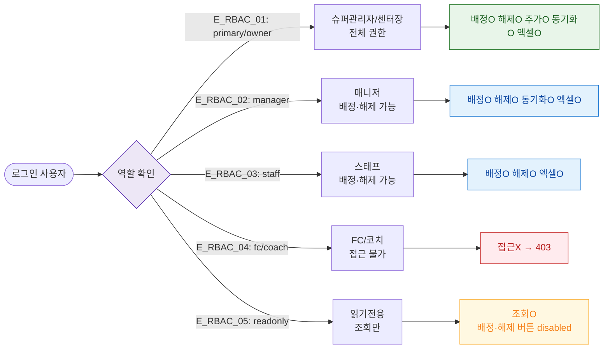

# F7 권한(RBAC) 분기 플로우 — SCR-051 사물함 배정 관리

## 1. 목적
6개 역할별 접근·배정·해제 권한 분기를 정의한다.

## 2. 다이어그램

## 4. 엣지 설명

| 엣지 ID | 역할 | 권한 범위 |
|---------|------|-----------|
| E_RBAC_01 | primary/owner | 전체 |
| E_RBAC_02 | manager | 배정·해제·동기화·엑셀 |
| E_RBAC_03 | staff | 배정·해제·엑셀 |
| E_RBAC_04 | fc/coach | 접근 불가 |
| E_RBAC_05 | readonly | 조회만 |

## 5. TC 후보

| TC ID | 타입 | Given | When | Then |
|-------|:----:|-------|------|------|
| TC-051-F7-01 | negative | FC 로그인 | 사이드바 사물함 배정 클릭 | 메뉴 숨김 or 403 |
| TC-051-F7-02 | negative | readonly 로그인 | 배정하기 버튼 확인 | disabled 상태 |
