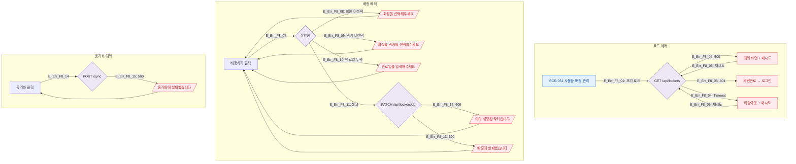

# F8 에러/예외/복구 플로우 — SCR-051 사물함 배정 관리

## 1. 목적
배정·해제·동기화 각 액션의 에러 분기와 복구 경로를 정의한다.

## 2. 다이어그램

## 4. 엣지 설명

| 엣지 ID | 에러 | 복구 |
|---------|------|------|
| E_Err_F8_08~10 | 폼 미입력 | 입력 후 재시도 |
| E_Err_F8_12 | 409 충돌 | 다른 락커 선택 |
| E_Err_F8_13 | 500 | 자동 폼 유지 |
| E_Err_F8_15 | 동기화 500 | 재클릭 |

## 5. TC 후보

| TC ID | 타입 | Given | When | Then |
|-------|:----:|-------|------|------|
| TC-051-005 | negative | 회원 미선택 | 배정하기 클릭 | 버튼 disabled or 에러 |
| TC-051-F8-01 | exception | API 500 | 배정 시도 | 실패 토스트 |
| TC-051-F8-02 | exception | 401 | 페이지 로드 | 로그인 리다이렉트 |
