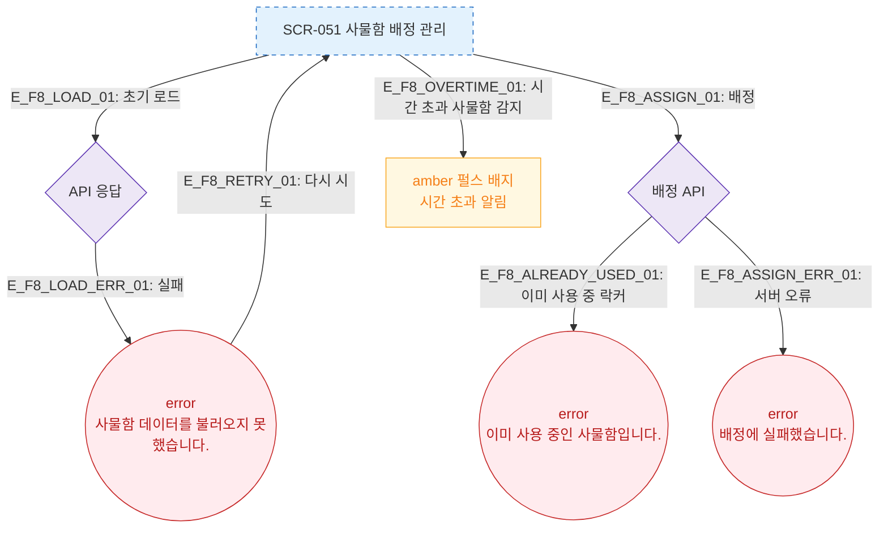

# F8 에러/예외/복구 플로우 — SCR-051 사물함 배정 관리

## 다이어그램

## TC 후보

| TC ID | 타입 | Given | When | Then |
|-------|------|-------|------|------|
| TC-051-002 | negative | 이미 사용 중 락커 선택 | 배정하기 클릭 | error "이미 사용 중인 사물함" |
