# F9 토스트/피드백 플로우 — SCR-051 사물함 배정 관리

## 1. 목적
모든 액션의 success 토스트 발생 조건을 정의한다.

## 2. 다이어그램

```mermaid
flowchart TD
    Actions([SCR-051 액션])

    subgraph SuccessToasts["success 토스트"]
        T_S1((상태 동기화\n락커 상태를 동기화했습니다))
        T_S2((락커 추가\n락커 N번이 추가되었습니다))
        T_S3((엑셀 다운로드\n엑셀 다운로드가 완료되었습니다))
        T_S4((배정 완료\n3초 성공 메시지))
        T_S5((일괄 해제\개 락커가 일괄 해제되었습니다))
    end

    subgraph ErrorToasts["error 토스트"]
        T_E1[/회원을 선택해주세요/]
        T_E2[/배정할 락커를 선택해주세요/]
        T_E3[/만료일을 입력해주세요/]
        T_E4[/이미 배정된 락커입니다/]
        T_E5[/배정에 실패했습니다/]
        T_E6[/동기화에 실패했습니다/]
    end

    subgraph WarnToasts["warning 토스트"]
        T_W1[overtime 락커 N건\n일괄 해제 권장]
    end

    Actions -->|"E_Toast_F9_01: 동기화 200"|T_S1
    Actions -->|"E_Toast_F9_02: 추가 200"|T_S2
    Actions -->|"E_Toast_F9_03: 엑셀 완료"|T_S3
    Actions -->|"E_Toast_F9_04: 배정 200"|T_S4
    Actions -->|"E_Toast_F9_05: 일괄해제 200"|T_S5
    Actions -->|"E_Toast_F9_06: 회원 미선택"|T_E1
    Actions -->|"E_Toast_F9_07: 락커 미선택"|T_E2
    Actions -->|"E_Toast_F9_08: 만료일 누락"|T_E3
    Actions -->|"E_Toast_F9_09: 409"|T_E4
    Actions -->|"E_Toast_F9_10: 배정 500"|T_E5
    Actions -->|"E_Toast_F9_11: 동기화 500"|T_E6
    Actions -->|"E_Toast_F9_12: overtime 감지"|T_W1

    classDef success fill:#E8F5E9,stroke:#2E7D32,color:#1B5E20
    classDef error fill:#FFEBEE,stroke:#C62828,color:#B71C1C
    classDef warning fill:#FFF8E1,stroke:#F9A825,color:#F57F17
    classDef system fill:#EDE7F6,stroke:#5E35B2

    class T_S1,T_S2,T_S3,T_S4,T_S5 success
    class T_E1,T_E2,T_E3,T_E4,T_E5,T_E6 error
    class T_W1 warning
    class Actions system
```

## 4. 엣지 설명

| 조건 | 타입 | |---------|------|------| | E_Toast_F9_01~05 | API 200 | success | | E_Toast_F9_06~11 | 검증실패/5xx/409 | error | | E_Toast_F9_12 | overtime 감지 | warning |
