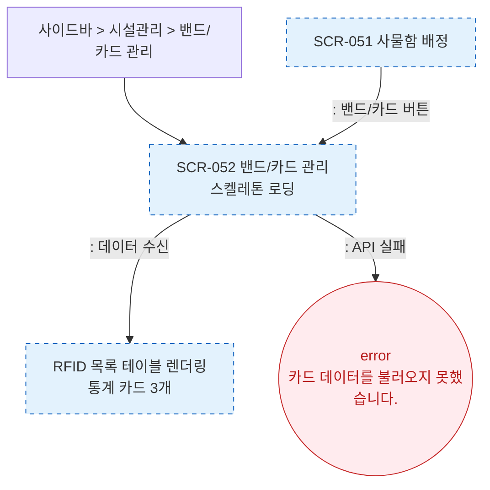

# F1 진입 플로우 — SCR-052 밴드/카드 관리

## 다이어그램

```mermaid
flowchart TD
    NAV[사이드바 > 시설관리 > 밴드/카드 관리] --> SCR_052[SCR-052 밴드/카드 관리\n스켈레톤 로딩]
    SCR_051[SCR-051 사물함 배정] -->|": 밴드/카드 버튼"|SCR_052

    SCR_052 -->|": 데이터 수신"|Ready[RFID 목록 테이블 렌더링\n통계 카드 3개]
    SCR_052 -->|": API 실패"|ErrToast((error\n카드 데이터를 불러오지 못했습니다.))

    classDef screen fill:#E3F2FD,stroke:#1565C0,stroke-dasharray:5 5
    classDef error fill:#FFEBEE,stroke:#C62828,color:#B71C1C
    class SCR_052,Ready,SCR_051 screen
    class ErrToast error
```

## TC 후보

| TC ID | 타입 | Given | When | Then | |-------|------|-------|------|------| | TC-052-007 | positive | 카드번호 검색 | "RF-1029" 입력 | 해당 카드만 표시 |
