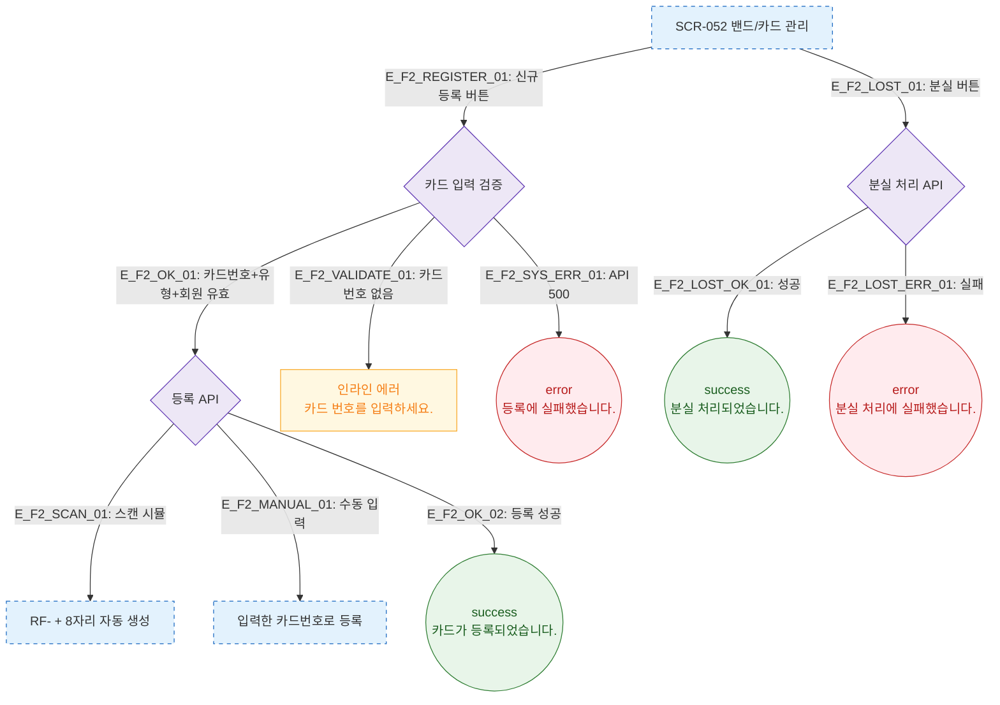

# F2 메인 인터랙션 플로우 — SCR-052 밴드/카드 관리

## 다이어그램

## TC 후보

| TC ID | 타입 | Given | When | Then |
|-------|------|-------|------|------|
| TC-052-001 | positive | 신규 등록 → 스캔 | 스캔 시뮬 | "RF-" + 8자리 자동 생성 |
| TC-052-002 | positive | 신규 등록 → 수동 | 카드번호 직접 입력 | 입력값으로 등록 |
| TC-052-004 | positive | 활성 카드 분실 | 분실 버튼 클릭 | 상태 "분실"로 변경 |
