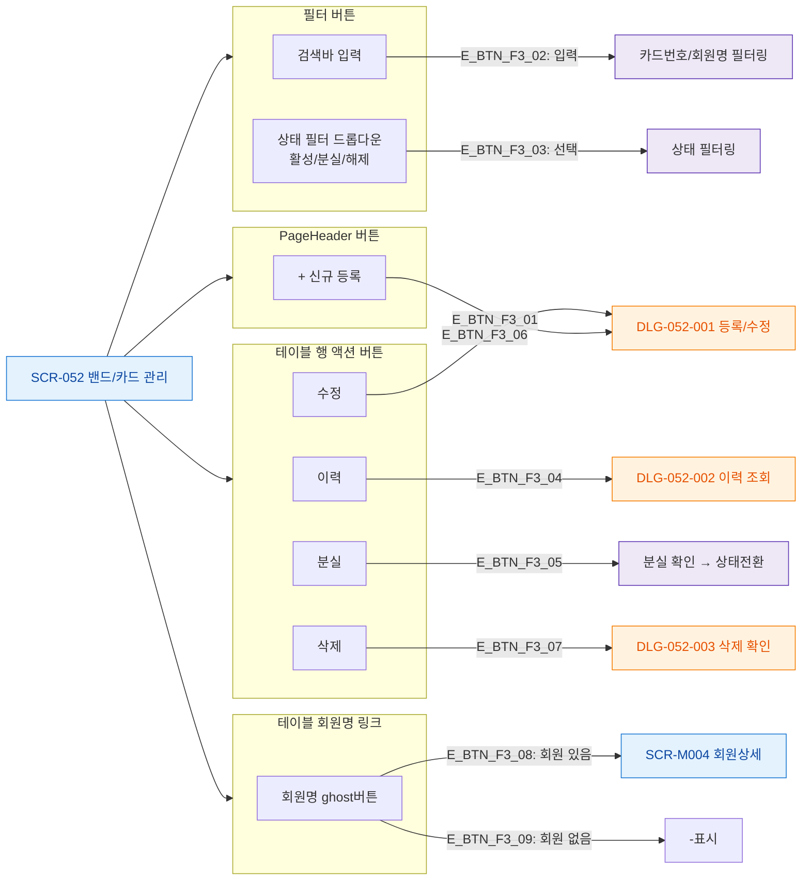

# F3 버튼/액션 매핑 — SCR-052 밴드/카드 관리

## 1. 목적
화면 내 모든 버튼을 노드화한다.

## 2. 다이어그램

## 4. 엣지 설명

| 엣지 ID | 버튼 | 동작 |
|---------|------|------|
| E_BTN_F3_01 | 신규 등록 | DLG-052-001 열기 |
| E_BTN_F3_02~03 | 검색/필터 | 테이블 필터링 |
| E_BTN_F3_04~07 | 행 액션 | DLG 또는 직접 처리 |
| E_BTN_F3_08 | 회원명 링크 | 회원상세 이동 |

## 5. TC 후보

| TC ID | 타입 | Given | When | Then |
|-------|:----:|-------|------|------|
| TC-052-007 | positive | 카드 존재 | "RF-1029" 검색 | 해당 카드만 표시 |
| TC-052-008 | positive | 분실 카드 존재 | 상태 "분실" 선택 | 분실 카드만 표시 |
| TC-052-006 | positive | 이력 클릭 | 기간 선택 → 조회 | 해당 기간 이력 표시 |
