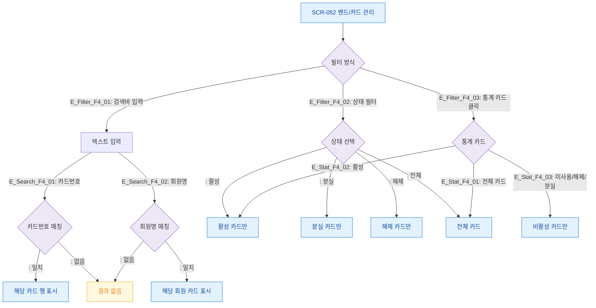

# F4 필터/검색 플로우 — SCR-052 밴드/카드 관리

## 1. 목적
검색바·상태 필터·통계 카드 클릭의 조합 동작을 정의한다.

## 2. 다이어그램

## 4. 엣지 설명

| 필터 방식 | 결과 | |---------|-----------|------| | E_Search_F4_01~02 | 텍스트 검색 | 카드번호/회원명 매칭 | | ~04 | 상태 드롭다운 | 상태별 필터 | | E_Stat_F4_01~03 | 통계 카드 클릭 | 상태별 필터 |
