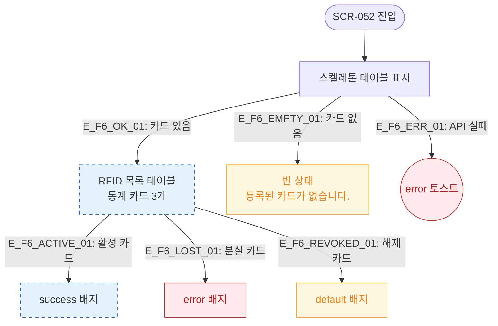

# F6 상태별 화면 플로우 — SCR-052 밴드/카드 관리

## 다이어그램

## TC 후보

| TC ID | 타입 | Given | When | Then |
|-------|------|-------|------|------|
| TC-052-008 | positive | 상태 필터 "분실" | 선택 | 분실 카드만 표시, error 배지 |
