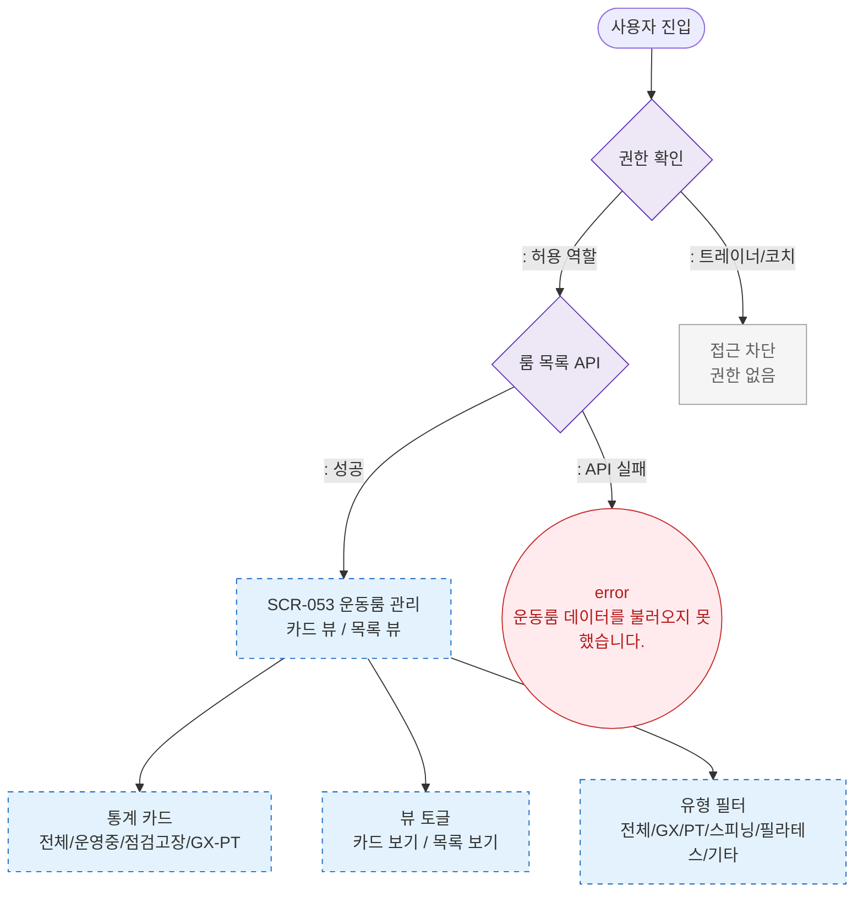

# F1 진입 플로우 — SCR-053 운동룸 관리

## 다이어그램

```mermaid
flowchart TD
    START([사용자 진입]) --> AuthCheck{권한 확인}

    AuthCheck -->|": 허용 역할"|LoadAPI{룸 목록 API}
    AuthCheck -->|": 트레이너/코치"|Blocked[접근 차단\n권한 없음]

    LoadAPI -->|": 성공"|SCR_053[SCR-053 운동룸 관리\n카드 뷰 / 목록 뷰]
    LoadAPI -->|": API 실패"|ErrToast((error\n운동룸 데이터를 불러오지 못했습니다.))

    SCR_053 --> StatCards[통계 카드\n전체/운영중/점검고장/GX-PT]
    SCR_053 --> ViewToggle[뷰 토글\n카드 보기 / 목록 보기]
    SCR_053 --> TypeFilter[유형 필터\n전체/GX/PT/스피닝/필라테스/기타]

    classDef screen fill:#E3F2FD,stroke:#1565C0,stroke-dasharray:5 5
    classDef error fill:#FFEBEE,stroke:#C62828,color:#B71C1C
    classDef rbacBlocked fill:#F5F5F5,stroke:#9E9E9E,color:#616161
    classDef system fill:#EDE7F6,stroke:#5E35B2
    class SCR_053,StatCards,ViewToggle,TypeFilter screen
    class ErrToast error
    class Blocked rbacBlocked
    class AuthCheck,LoadAPI system
```

## TC 후보

| TC ID | 타입 | Given | When | Then | |-------|------|-------|------|------| | TC-053-001 | positive | 매니저 로그인 | SCR-053 진입 | 룸 목록 카드 뷰 표시 |
