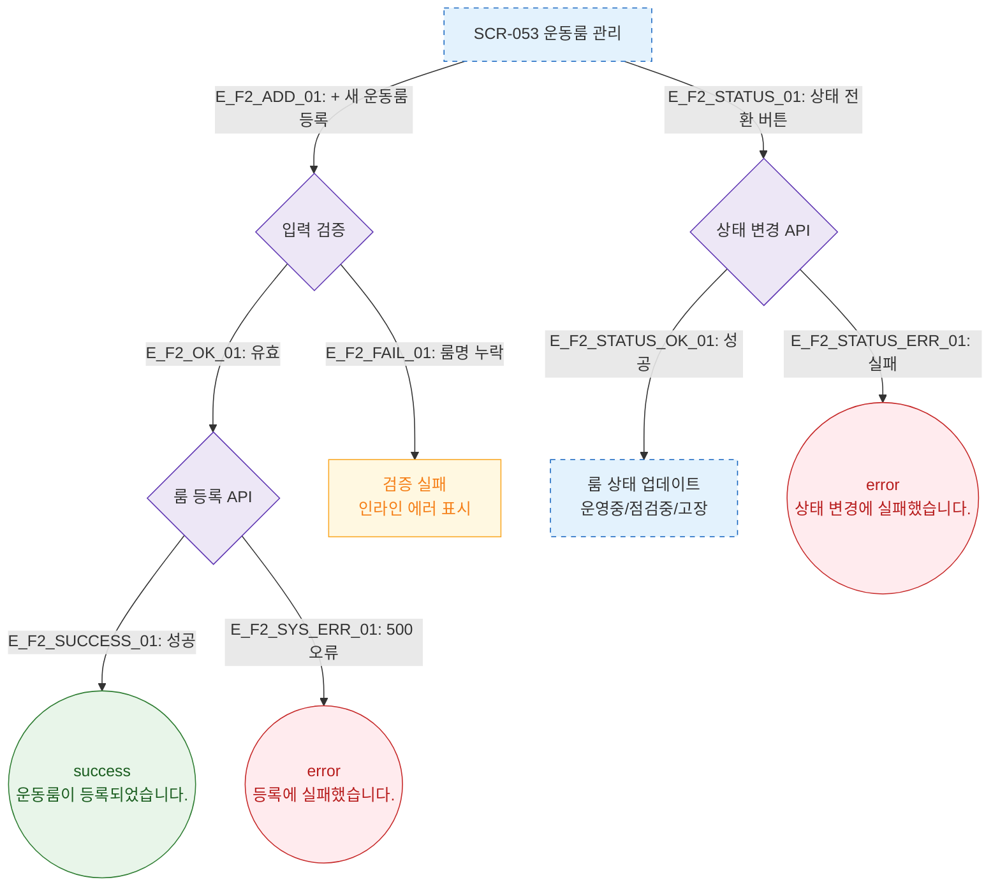

# F2 메인 인터랙션 플로우 — SCR-053 운동룸 관리

## 다이어그램

## TC 후보

| TC ID | 타입 | Given | When | Then |
|-------|------|-------|------|------|
| TC-053-002 | positive | 룸명 입력 완료 | 저장 클릭 | success 토스트, 목록에 추가 |
| TC-053-003 | negative | 룸명 미입력 | 저장 클릭 | 인라인 에러 표시 |
