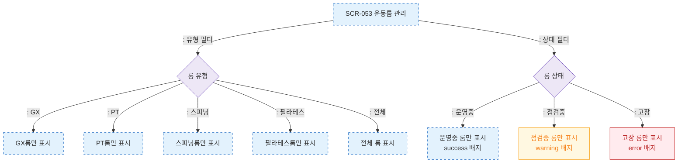

# F4 필터/검색/정렬 — SCR-053 운동룸 관리

## 다이어그램

## TC 후보

| TC ID | 타입 | Given | When | Then | |-------|------|-------|------|------| | TC-053-006 | positive | 룸 목록 | 유형 "GX" 선택 | GX룸만 표시 | | TC-053-007 | positive | 룸 목록 | 상태 "점검중" 선택 | 점검중 룸만 표시 |
