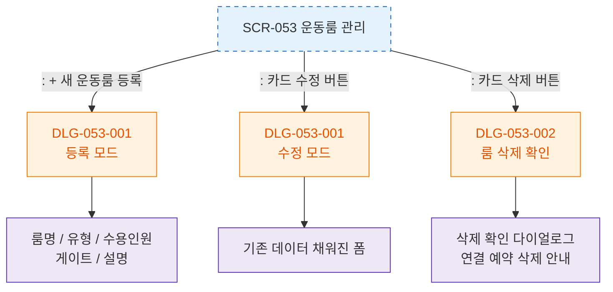

# F5 모달 트리거 트리 — SCR-053 운동룸 관리

## 다이어그램

## TC 후보

| TC ID | 타입 | Given | When | Then | |-------|------|-------|------|------| | TC-053-004 | positive | SCR-053 | 수정 버튼 클릭 | DLG-053-001 수정 모드 열림 | | TC-053-005 | positive | SCR-053 | 삭제 버튼 클릭 | DLG-053-002 열림 |
