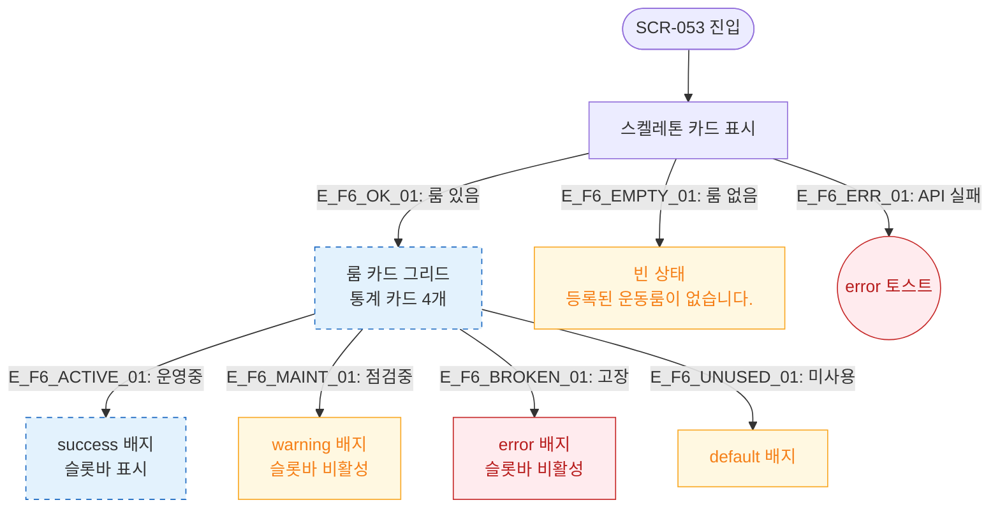

# F6 상태별 화면 플로우 — SCR-053 운동룸 관리

## 다이어그램

## TC 후보

| TC ID | 타입 | Given | When | Then |
|-------|------|-------|------|------|
| TC-053-007 | positive | 상태 필터 "점검중" | 선택 | 점검중 룸만 표시, warning 배지 |
