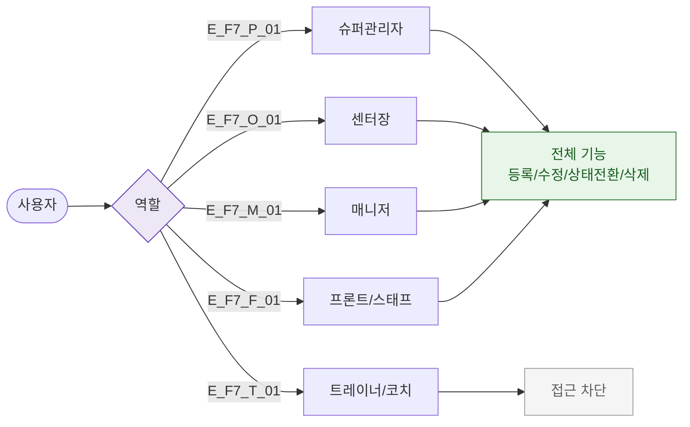

# F7 권한(RBAC) 분기 플로우 — SCR-053 운동룸 관리

## 다이어그램

```mermaid
flowchart LR
    USER([사용자]) --> RoleCheck{역할}

    RoleCheck -->|E_F7_P_01| P[슈퍼관리자]
    RoleCheck -->|E_F7_O_01| O[센터장]
    RoleCheck -->|E_F7_M_01| M[매니저]
    RoleCheck -->|E_F7_F_01| F[프론트/스태프]
    RoleCheck -->|E_F7_T_01| T[트레이너/코치]

    P & O & M & F --> Full[전체 기능\n등록/수정/상태전환/삭제]
    T --> Blocked[접근 차단]

    classDef success fill:#E8F5E9,stroke:#2E7D32,color:#1B5E20
    classDef rbacBlocked fill:#F5F5F5,stroke:#9E9E9E,color:#616161
    classDef system fill:#EDE7F6,stroke:#5E35B2
    class Full success
    class Blocked rbacBlocked
    class RoleCheck system
```

## TC 후보

| TC ID | 타입 | Given | When | Then |
|-------|------|-------|------|------|
| - | - | - | - | - |
