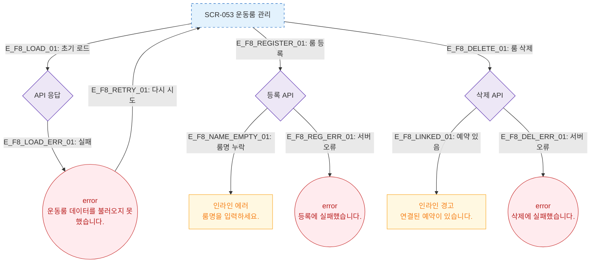

# F8 에러/예외/복구 플로우 — SCR-053 운동룸 관리

## 다이어그램

```mermaid
flowchart TD
    SCR_053[SCR-053 운동룸 관리]

    SCR_053 -->|E_F8_LOAD_01: 초기 로드| LoadAPI{API 응답}
    LoadAPI -->|E_F8_LOAD_ERR_01: 실패| ErrLoad((error\n운동룸 데이터를 불러오지 못했습니다.))
    ErrLoad -->|E_F8_RETRY_01: 다시 시도| SCR_053

    SCR_053 -->|E_F8_REGISTER_01: 룸 등록| RegAPI{등록 API}
    RegAPI -->|E_F8_NAME_EMPTY_01: 룸명 누락| ErrName[인라인 에러\n룸명을 입력하세요.]
    RegAPI -->|E_F8_REG_ERR_01: 서버 오류| ErrReg((error\n등록에 실패했습니다.))

    SCR_053 -->|E_F8_DELETE_01: 룸 삭제| DelAPI{삭제 API}
    DelAPI -->|E_F8_LINKED_01: 예약 있음| ErrLinked[인라인 경고\n연결된 예약이 있습니다.]
    DelAPI -->|E_F8_DEL_ERR_01: 서버 오류| ErrDel((error\n삭제에 실패했습니다.))

    classDef screen fill:#E3F2FD,stroke:#1565C0,stroke-dasharray:5 5
    classDef error fill:#FFEBEE,stroke:#C62828,color:#B71C1C
    classDef warning fill:#FFF8E1,stroke:#F9A825,color:#F57F17
    classDef system fill:#EDE7F6,stroke:#5E35B2
    class SCR_053 screen
    class ErrLoad,ErrReg,ErrDel error
    class ErrName,ErrLinked warning
    class LoadAPI,RegAPI,DelAPI system
```

## TC 후보

| TC ID | 타입 | Given | When | Then |
|-------|------|-------|------|------|
| TC-053-003 | negative | 룸명 미입력 | 저장 클릭 | 인라인 에러 "룸명을 입력하세요." |
