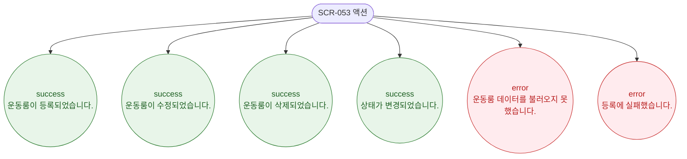

# F9 토스트/피드백 플로우 — SCR-053 운동룸 관리

## 다이어그램

## TC 후보

| TC ID | 타입 | Given | When | Then | |-------|------|-------|------|------| | TC-053-002 | positive | 룸 등록 성공 | 저장 클릭 | success 토스트 "운동룸이 등록되었습니다." | | TC-053-008 | positive | 상태 변경 성공 | 상태 전환 | success 토스트 "상태가 변경되었습니다." |
