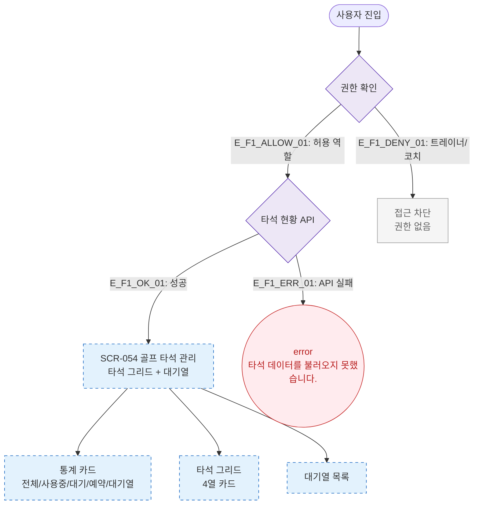

# F1 진입 플로우 — SCR-054 골프 타석 관리

## 다이어그램

```mermaid
flowchart TD
    START([사용자 진입]) --> AuthCheck{권한 확인}

    AuthCheck -->|E_F1_ALLOW_01: 허용 역할| LoadAPI{타석 현황 API}
    AuthCheck -->|E_F1_DENY_01: 트레이너/코치| Blocked[접근 차단\n권한 없음]

    LoadAPI -->|E_F1_OK_01: 성공| SCR_054[SCR-054 골프 타석 관리\n타석 그리드 + 대기열]
    LoadAPI -->|E_F1_ERR_01: API 실패| ErrToast((error\n타석 데이터를 불러오지 못했습니다.))

    SCR_054 --> StatCards[통계 카드\n전체/사용중/대기/예약/대기열]
    SCR_054 --> BayGrid[타석 그리드\n4열 카드]
    SCR_054 --> WaitQueue[대기열 목록]

    classDef screen fill:#E3F2FD,stroke:#1565C0,stroke-dasharray:5 5
    classDef error fill:#FFEBEE,stroke:#C62828,color:#B71C1C
    classDef rbacBlocked fill:#F5F5F5,stroke:#9E9E9E,color:#616161
    classDef system fill:#EDE7F6,stroke:#5E35B2
    class SCR_054,StatCards,BayGrid,WaitQueue screen
    class ErrToast error
    class Blocked rbacBlocked
    class AuthCheck,LoadAPI system
```

## TC 후보

| TC ID | 타입 | Given | When | Then |
|-------|------|-------|------|------|
| TC-054-001 | positive | 매니저 로그인 | SCR-054 진입 | 타석 그리드 + 대기열 표시 |
