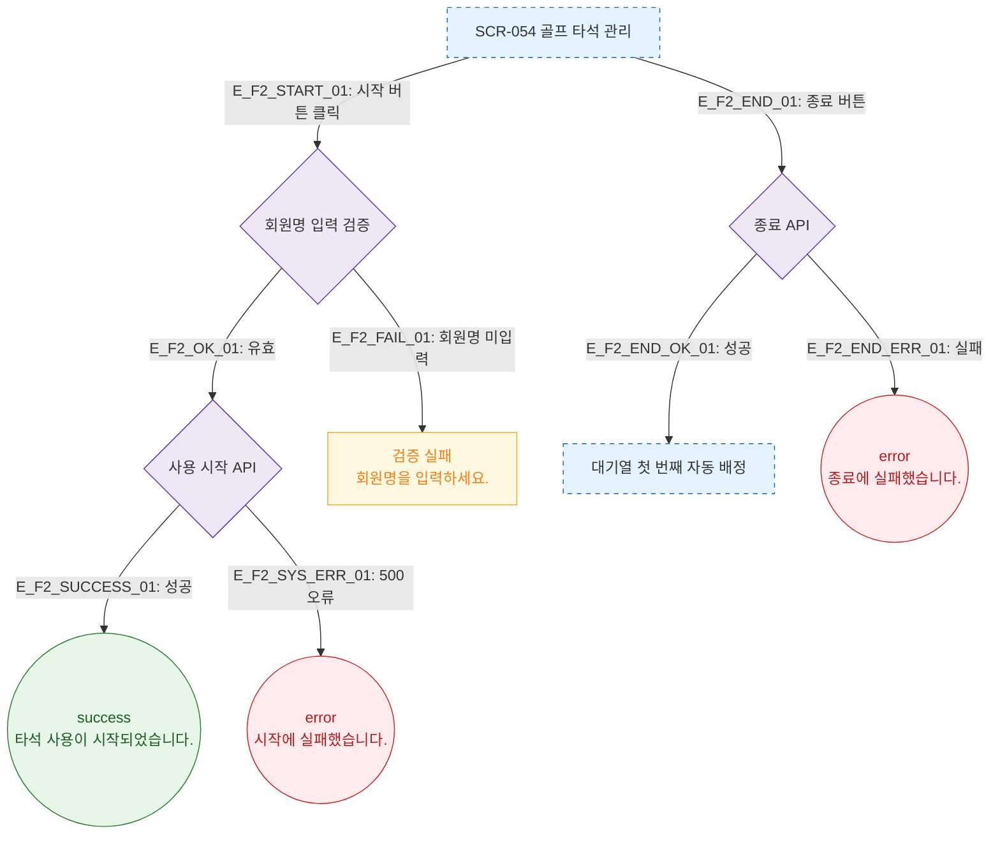

# F2 메인 인터랙션 플로우 — SCR-054 골프 타석 관리

## 다이어그램

## TC 후보

| TC ID | 타입 | Given | When | Then |
|-------|------|-------|------|------|
| TC-054-002 | positive | 대기 타석 | 시작 버튼 → 회원명 입력 | success 토스트, 타이머 시작 |
| TC-054-003 | negative | 대기 타석 | 시작 버튼 → 회원명 미입력 | 검증 실패 메시지 |
| TC-054-004 | positive | 사용중 타석 | 종료 버튼 | 타석 초기화, 대기열 자동 배정 |
