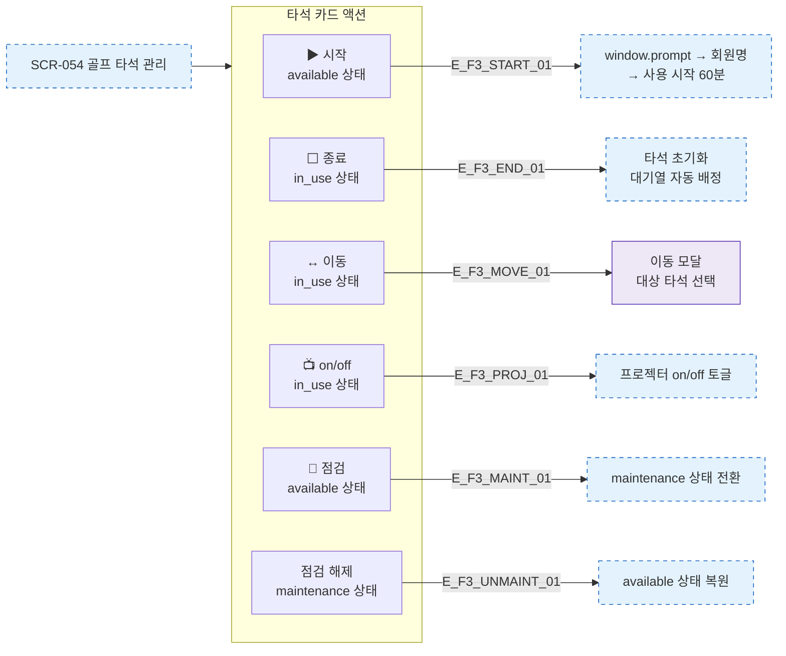

# F3 버튼 액션 플로우 — SCR-054 골프 타석 관리

## 다이어그램

## TC 후보

| TC ID | 타입 | Given | When | Then |
|-------|------|-------|------|------|
| TC-054-002 | positive | 대기 타석 | 시작 버튼 → 회원명 입력 | 타이머 시작, in_use 상태 |
| TC-054-005 | positive | 사용중 타석 | 이동 버튼 | 이동 모달 표시 |
