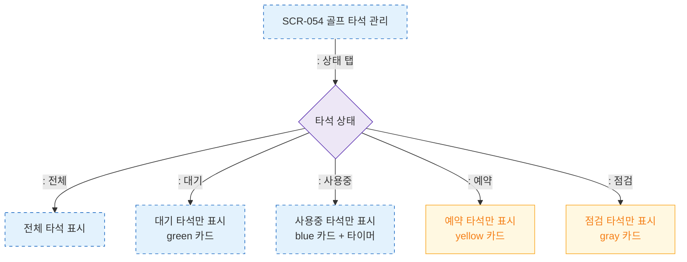

# F4 필터/검색/정렬 — SCR-054 골프 타석 관리

## 다이어그램

## TC 후보

| TC ID | 타입 | Given | When | Then | |-------|------|-------|------|------| | TC-054-006 | positive | 타석 목록 | 상태 "사용중" 선택 | 사용중 타석만 표시, 타이머 노출 |
