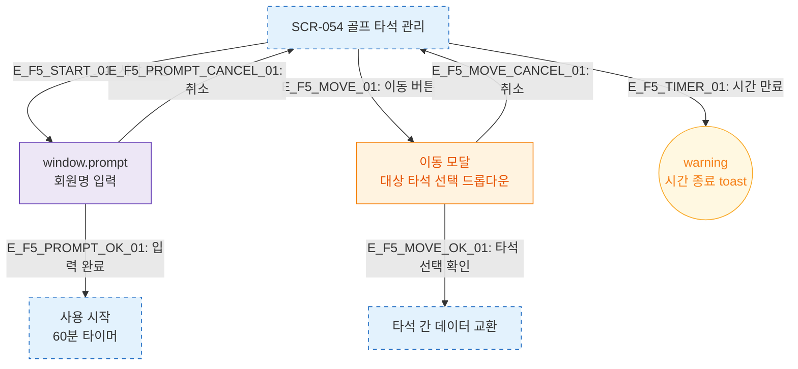

# F5 모달 트리거 트리 — SCR-054 골프 타석 관리

## 다이어그램

## TC 후보

| TC ID | 타입 | Given | When | Then |
|-------|------|-------|------|------|
| TC-054-005 | positive | 사용중 타석 | 이동 버튼 클릭 | 이동 모달 표시, 대상 타석 선택 |
