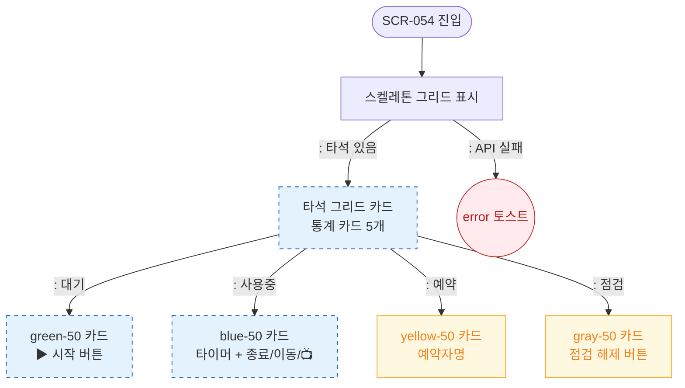

# F6 상태별 화면 플로우 — SCR-054 골프 타석 관리

## 다이어그램

## TC 후보

| TC ID | 타입 | Given | When | Then | |-------|------|-------|------|------| | TC-054-006 | positive | 사용중 타석 | 화면 진입 | blue 카드, 타이머 카운트다운 표시 |
