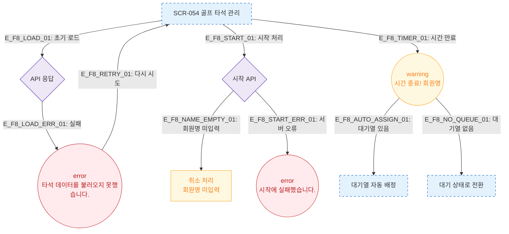

# F8 에러/예외/복구 플로우 — SCR-054 골프 타석 관리

## 다이어그램

## TC 후보

| TC ID | 타입 | Given | When | Then |
|-------|------|-------|------|------|
| TC-054-003 | negative | 대기 타석 | 시작 버튼 → 회원명 미입력 취소 | 타석 상태 변경 없음 |
