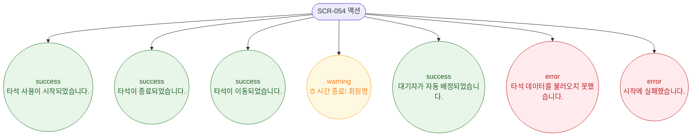

# F9 토스트/피드백 플로우 — SCR-054 골프 타석 관리

## 다이어그램

## TC 후보

| TC ID | 타입 | Given | When | Then | |-------|------|-------|------|------| | TC-054-002 | positive | 대기 타석 | 시작 처리 | success 토스트 "타석 사용이 시작되었습니다." | | TC-054-004 | positive | 사용중 타석 | 종료 처리 | success 토스트 "타석이 종료되었습니다." | | TC-054-007 | positive | 60분 경과 | 자동 시간 만료 | warning 토스트 "⏰ 시간 종료!" |
