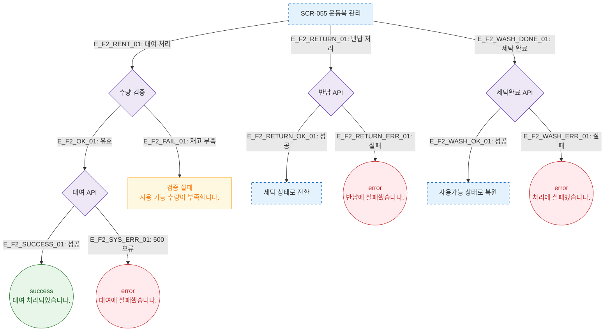

# F2 메인 인터랙션 플로우 — SCR-055 운동복 관리

## 다이어그램

## TC 후보

| TC ID | 타입 | Given | When | Then |
|-------|------|-------|------|------|
| TC-055-002 | positive | 사용가능 재고 있음 | 대여 처리 | success 토스트, 재고 감소 |
| TC-055-003 | negative | 사용가능 재고 0 | 대여 시도 | 검증 실패 "재고 부족" |
| TC-055-004 | positive | 대여중 항목 | 반납 처리 | 세탁 상태로 전환 |
