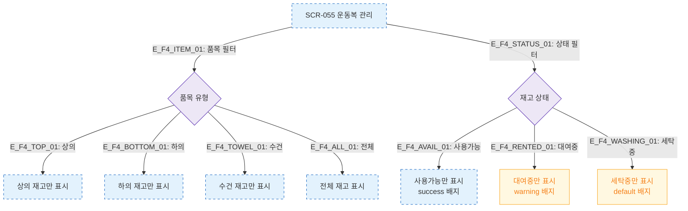

# F4 필터/검색/정렬 — SCR-055 운동복 관리

## 다이어그램

## TC 후보

| TC ID | 타입 | Given | When | Then |
|-------|------|-------|------|------|
| TC-055-005 | positive | 재고 목록 | 품목 "수건" 선택 | 수건 재고만 표시 |
| TC-055-006 | positive | 재고 목록 | 상태 "대여중" 선택 | 대여중 항목만 표시 |
