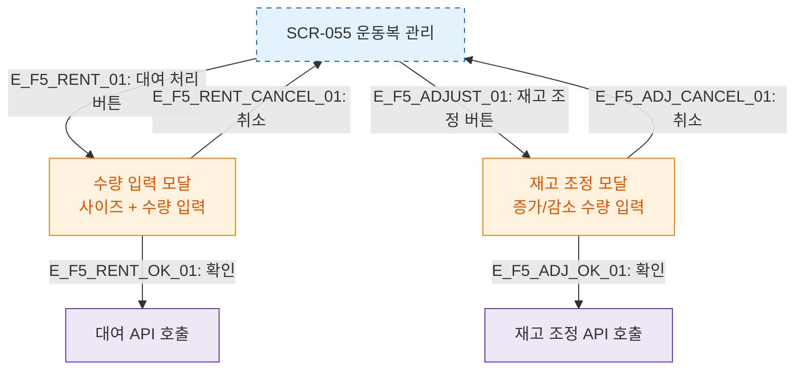

# F5 모달 트리거 트리 — SCR-055 운동복 관리

## 다이어그램

```mermaid
flowchart TD
    SCR_055[SCR-055 운동복 관리]

    SCR_055 -->|E_F5_RENT_01: 대여 처리 버튼| RentModal[수량 입력 모달\n사이즈 + 수량 입력]
    SCR_055 -->|E_F5_ADJUST_01: 재고 조정 버튼| AdjModal[재고 조정 모달\n증가/감소 수량 입력]

    RentModal -->|E_F5_RENT_OK_01: 확인| RentAPI[대여 API 호출]
    RentModal -->|E_F5_RENT_CANCEL_01: 취소| SCR_055

    AdjModal -->|E_F5_ADJ_OK_01: 확인| AdjAPI[재고 조정 API 호출]
    AdjModal -->|E_F5_ADJ_CANCEL_01: 취소| SCR_055

    classDef screen fill:#E3F2FD,stroke:#1565C0,stroke-dasharray:5 5
    classDef modal fill:#FFF3E0,stroke:#F57C00,color:#E65100
    classDef system fill:#EDE7F6,stroke:#5E35B2
    class SCR_055 screen
    class RentModal,AdjModal modal
    class RentAPI,AdjAPI system
```

## TC 후보

| TC ID | 타입 | Given | When | Then |
|-------|------|-------|------|------|
| TC-055-002 | positive | SCR-055 | 대여 처리 클릭 | 수량 입력 모달 열림 |
