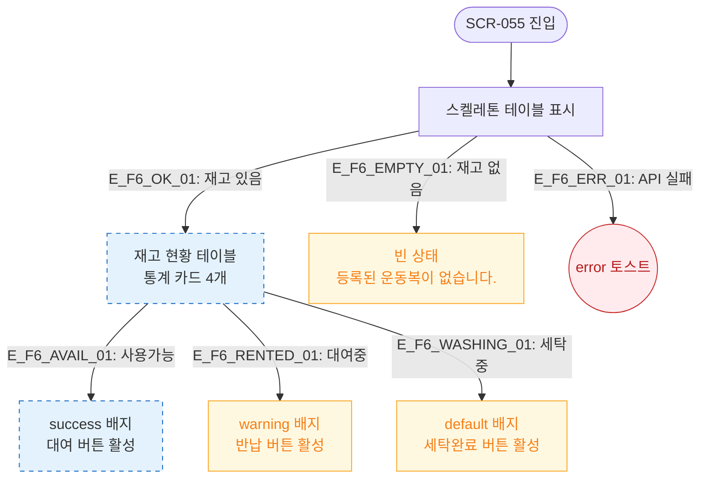

# F6 상태별 화면 플로우 — SCR-055 운동복 관리

## 다이어그램

## TC 후보

| TC ID | 타입 | Given | When | Then |
|-------|------|-------|------|------|
| TC-055-006 | positive | 상태 필터 "대여중" | 선택 | 대여중 항목만 표시, warning 배지 |
