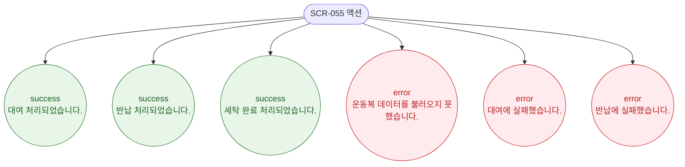

# F9 토스트/피드백 플로우 — SCR-055 운동복 관리

## 다이어그램

## TC 후보

| TC ID | 타입 | Given | When | Then | |-------|------|-------|------|------| | TC-055-002 | positive | 대여 처리 성공 | 확인 클릭 | success 토스트 "대여 처리되었습니다." | | TC-055-004 | positive | 반납 처리 성공 | 반납 클릭 | success 토스트 "반납 처리되었습니다." |
