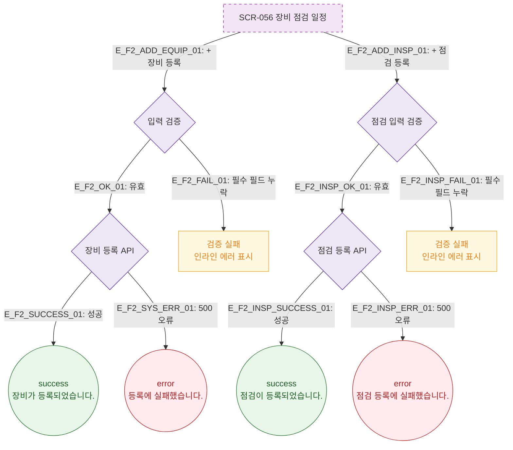

# F2 메인 인터랙션 플로우 — SCR-056 장비 점검 일정 🆕

## 다이어그램

## TC 후보

| TC ID | 타입 | Given | When | Then |
|-------|------|-------|------|------|
| TC-056-002 | positive | 필수 필드 입력 | 장비 등록 저장 | success 토스트, 목록에 추가 |
| TC-056-003 | negative | 필수 필드 누락 | 저장 클릭 | 인라인 에러 표시 |
