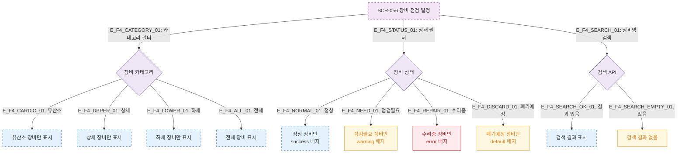

# F4 필터/검색/정렬 — SCR-056 장비 점검 일정 🆕

## 다이어그램

## TC 후보

| TC ID | 타입 | Given | When | Then |
|-------|------|-------|------|------|
| TC-056-005 | positive | 장비 목록 | 카테고리 "유산소" 선택 | 유산소 장비만 표시 |
| TC-056-006 | positive | 장비 목록 | 상태 "점검필요" 선택 | 점검필요 장비만 표시 |
