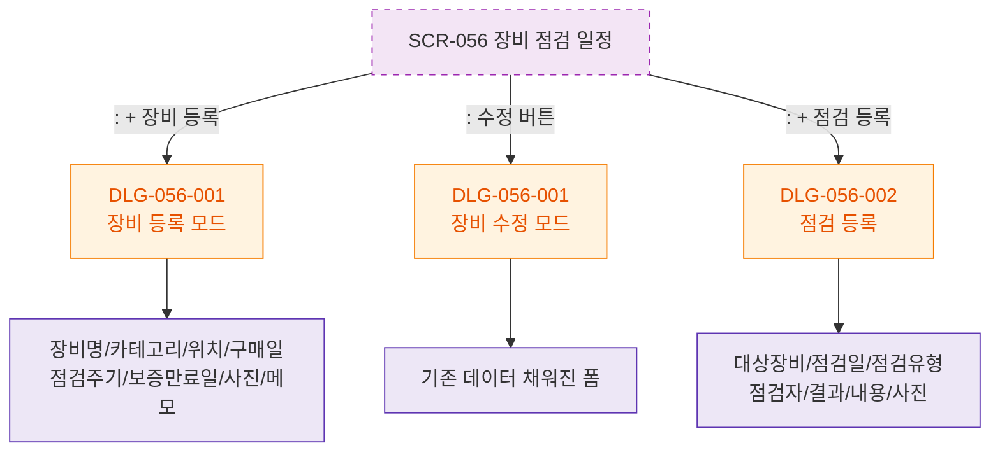

# F5 모달 트리거 트리 — SCR-056 장비 점검 일정 🆕

## 다이어그램

## TC 후보

| TC ID | 타입 | Given | When | Then | |-------|------|-------|------|------| | TC-056-002 | positive | SCR-056 | + 장비 등록 클릭 | DLG-056-001 등록 모드 열림 | | TC-056-004 | positive | SCR-056 | + 점검 등록 클릭 | DLG-056-002 열림 |
