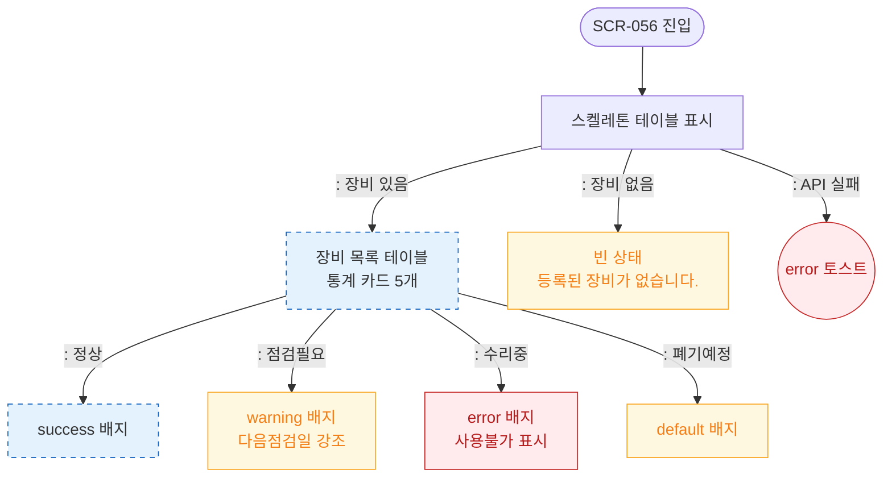

# F6 상태별 화면 플로우 — SCR-056 장비 점검 일정 🆕

## 다이어그램

## TC 후보

| TC ID | 타입 | Given | When | Then | |-------|------|-------|------|------| | TC-056-006 | positive | 상태 필터 "점검필요" | 선택 | 점검필요 장비만 표시, warning 배지 |
