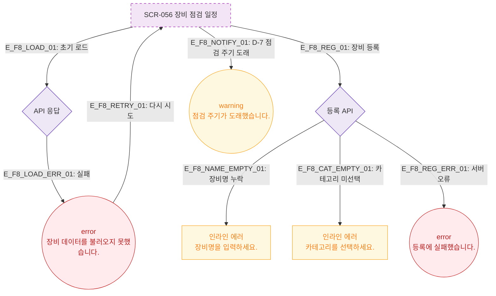

# F8 에러/예외/복구 플로우 — SCR-056 장비 점검 일정 🆕

## 다이어그램

## TC 후보

| TC ID | 타입 | Given | When | Then |
|-------|------|-------|------|------|
| TC-056-003 | negative | 장비명 미입력 | 저장 클릭 | 인라인 에러 "장비명을 입력하세요." |
