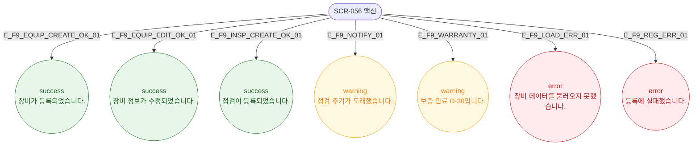

# F9 토스트/피드백 플로우 — SCR-056 장비 점검 일정 🆕

## 다이어그램

## TC 후보

| TC ID | 타입 | Given | When | Then |
|-------|------|-------|------|------|
| TC-056-002 | positive | 장비 등록 성공 | 저장 클릭 | success 토스트 "장비가 등록되었습니다." |
| TC-056-004 | positive | 점검 등록 성공 | 저장 클릭 | success 토스트 "점검이 등록되었습니다." |
| TC-056-007 | positive | 점검 주기 D-7 | 자동 감지 | warning 토스트 "점검 주기가 도래했습니다." |
