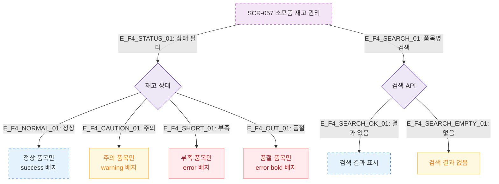

# F4 필터/검색/정렬 — SCR-057 소모품 재고 관리 🆕

## 다이어그램

## TC 후보

| TC ID | 타입 | Given | When | Then |
|-------|------|-------|------|------|
| TC-057-005 | positive | 재고 목록 | 상태 "부족" 선택 | 부족 품목만 표시, error 배지 |
| TC-057-006 | positive | 재고 목록 | 품목명 검색 | 해당 품목 표시 |
