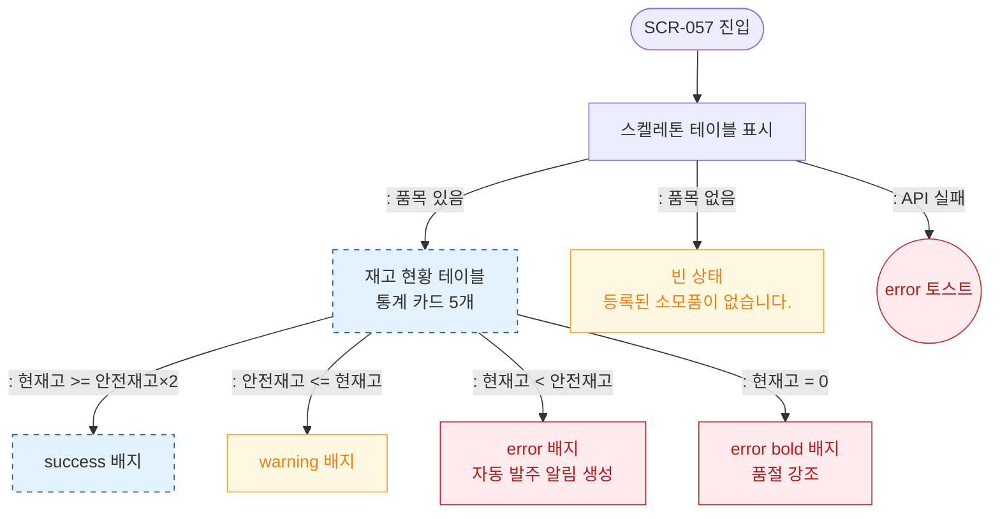

# F6 상태별 화면 플로우 — SCR-057 소모품 재고 관리 🆕

## 다이어그램

## TC 후보

| TC ID | 타입 | Given | When | Then | |-------|------|-------|------|------| | TC-057-005 | positive | 상태 필터 "부족" | 선택 | 부족 품목만 표시, error 배지 |
