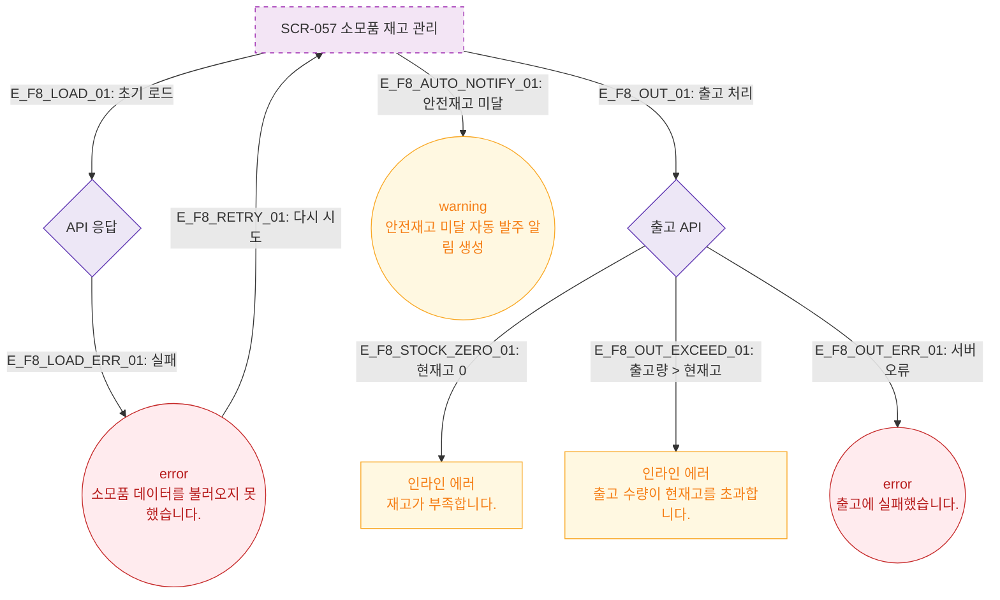

# F8 에러/예외/복구 플로우 — SCR-057 소모품 재고 관리 🆕

## 다이어그램

## TC 후보

| TC ID | 타입 | Given | When | Then |
|-------|------|-------|------|------|
| TC-057-004 | negative | 현재고 < 출고 수량 | 출고 시도 | 인라인 에러 "출고 수량이 현재고를 초과합니다." |
