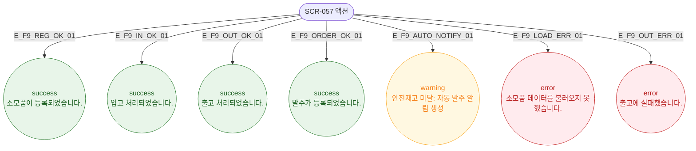

# F9 토스트/피드백 플로우 — SCR-057 소모품 재고 관리 🆕

## 다이어그램

## TC 후보

| TC ID | 타입 | Given | When | Then |
|-------|------|-------|------|------|
| TC-057-002 | positive | 입고 처리 성공 | 확인 클릭 | success 토스트 "입고 처리되었습니다." |
| TC-057-003 | positive | 출고 처리 성공 | 확인 클릭 | success 토스트 "출고 처리되었습니다." |
| TC-057-007 | positive | 현재고 < 안전재고 | 출고 후 자동 감지 | warning 토스트 "안전재고 미달" |
