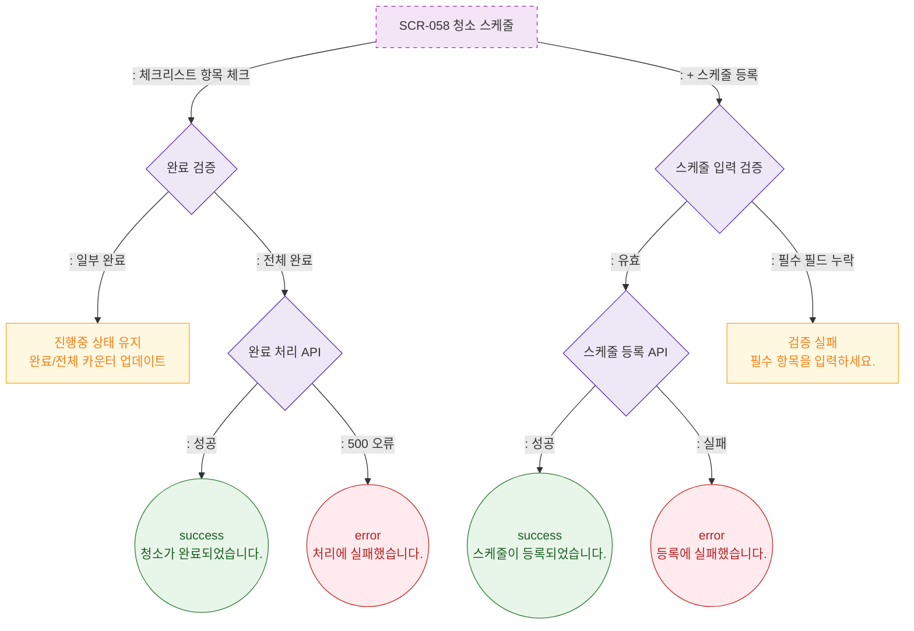

# F2 메인 인터랙션 플로우 — SCR-058 청소 스케줄 🆕

## 다이어그램

## TC 후보

| TC ID | 타입 | Given | When | Then | |-------|------|-------|------|------| | TC-058-002 | positive | 체크리스트 전체 완료 | 마지막 항목 체크 | 자동 완료 상태 전환, success 토스트 | | TC-058-003 | positive | 체크리스트 일부 완료 | 항목 체크 | 진행중 상태 유지, 카운터 업데이트 | | TC-058-004 | negative | 스케줄 등록 | 필수 필드 누락 | 검증 실패 메시지 |
