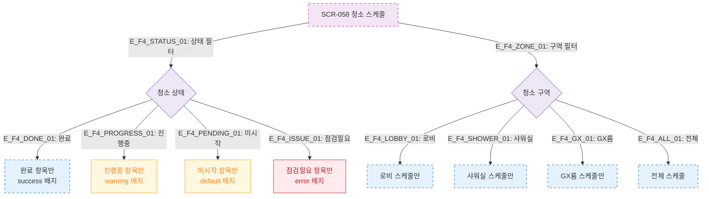

# F4 필터/검색/정렬 — SCR-058 청소 스케줄 🆕

## 다이어그램

## TC 후보

| TC ID | 타입 | Given | When | Then |
|-------|------|-------|------|------|
| TC-058-006 | positive | 스케줄 목록 | 상태 "미시작" 선택 | 미시작 항목만 표시 |
| TC-058-007 | positive | 스케줄 목록 | 구역 "샤워실" 선택 | 샤워실 스케줄만 표시 |
